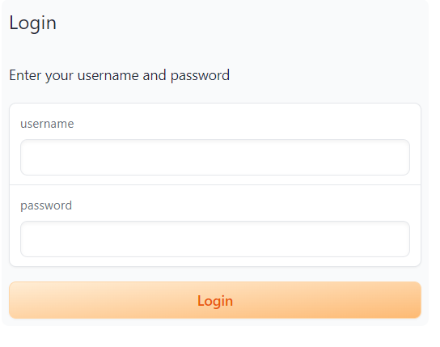
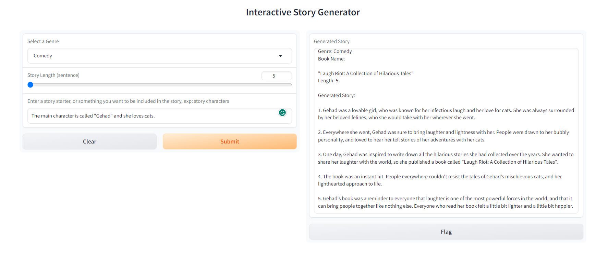

# Welcome to the Langchain Story Generator 📚✨

Explore the Langchain Story Generator, a creative AI project within the LangChain framework, that brings your storytelling dreams to life!

## Project Features 🌟

- **Genre-based Story Generation:** 📖🎭 Choose your story's genre, making it ideal for various creative applications.
- **Custom Sentence Generation:** 📝 Specify the number of sentences you want for a personalized narrative.
- **Optional Book Details:** 📕 Enhance your story by adding extra book information (it's optional!).

## Prototype Built with Gradio 🚀

The prototype is powered by Gradio, making it super simple to deploy and interact with the Langchain Story Generator. Create a fantastic user interface effortlessly!
<br>
<h2>Login Page</h2>

<h2>Story Generator Page</h2>


## Project Structure 📂
<code>
Langchain-Story-Generator
├── Components
│ ├── init.py
│ └── src
│ ├── handler.py
│ └── main.py
├── Prototype
│ ├── init.py
│ └── interface
├── init.py
├── README.md
</code>

## How to Use 🚀

**Clone the repository:**

```bash
git clone https://github.com/geehaad/Story-Generator.git
cd Story-Generator
```
**Download Requirements:** Ensure you have the necessary dependencies by running the following command in your terminal:
   ```bash
   pip install -r requirements.txt
  ```
- Run the project itself with a magic touch—execute `main.py` in the `Components/src` directory.
- For an enchanting experience, run the interface by invoking `interface.py` in the `Prototype/interface` directory.

**Heads-up!** The interface boasts an authentication page. Discover the keys in the `interface.py` file.

Check the respective directories in this repository for detailed setup and usage instructions.

## Limitations ⚠️

- **Cost of OpenAI API:** 💰 Be mindful of the cost associated with using OpenAI's API (find the price info on the OpenAI platform).
- **Domain Specific Knowledge:** 🔍 Language models may have limitations in domain-specific knowledge.
- **ChatGPT Data:** 📅 The data in ChatGPT may not always be up-to-date.


Thank you for embarking on this storytelling journey with the Langchain Story Generator! Contribute, create, and ignite your AI development projects with a touch of magic. 🪄✨

